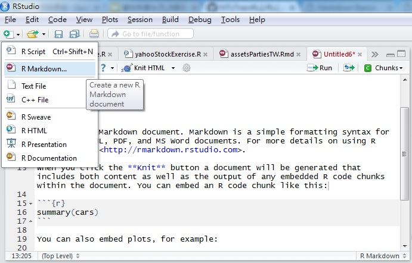
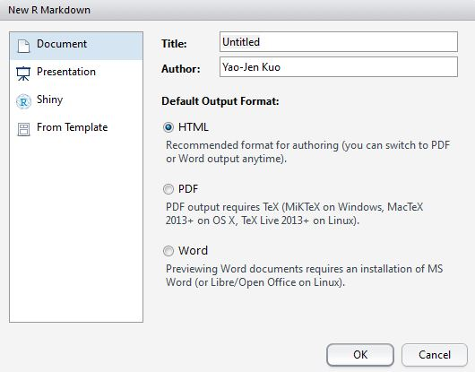
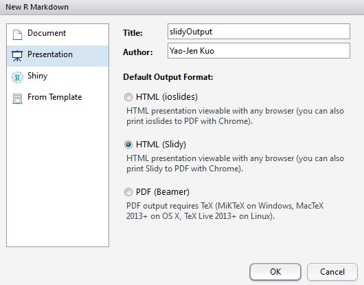

# NTUTrainRL2_4
This is the lecture notes for NTU Train Course of R Project Lecture 2_4

## R Markdown

### 什麼是Rmd?

R Markdown是一種編輯檔案格式(.Rmd)可以幫助使用者用R快速產生文件、簡報或報告，包含R程式碼區塊功能，可以讓產出的圖形、結果呈現在文件中。

### Rmd輸出為.html(normal)、.pdf、.html(slidy)

開啟新的R markdown檔案。

#### .html(normal)

指定**html_document**參數:`output: html_document`

#### .pdf
* 先安裝MikTeX
  http://miktex.org/download
* 執行MikTeX Update
  http://miktex.org/howto/update-miktex
* 指定**pdf_document**參數:`output: pdf_document`
  

#### .html(slidy)  

指定**slidy_presentation**參數:`output: slidy_presentation`

### Rmd Syntax Basics

[輸出為HTML](https://github.com/yaojenkuo/NTUTrainRL2/blob/master/htmlOutput.Rmd)

[輸出為pdf](https://github.com/yaojenkuo/NTUTrainRL2/blob/master/pdfOutput.Rmd)

[輸出為slidy pdf](https://github.com/yaojenkuo/NTUTrainRL2/blob/master/slidyOutput.Rmd)

## Reference
* [R Markdown v2](http://rmarkdown.rstudio.com/)

&copy; Tony Yao-Jen Kuo 2016